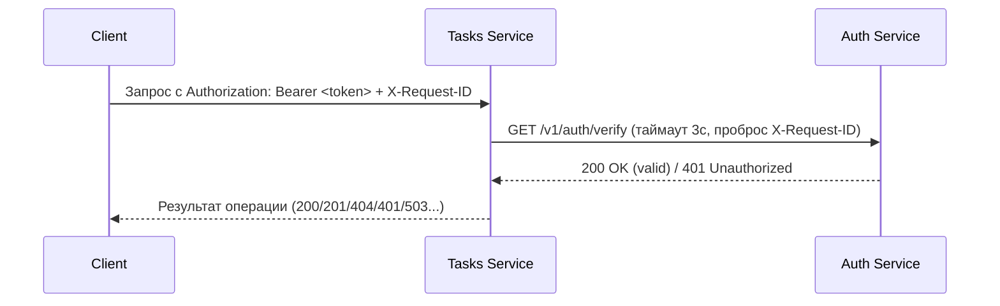

<h1 align="center"> Привет! Я <a target="_blank"> Кармеев Артур из группы ЭФМО-01-25 </a> 
</h1>
<h3 align="center"> Данная практика была выполнена с божьей помощью! :dizzy_face: </h3>

Структура проекта:

    └tech-ip-sem2/
    ├── go.mod
    ├── go.sum
    ├── README.md
    ├── tech-ip-sem2/
    │   ├── go.mod
    │   ├── go.sum
    │   ├── shared/
    │   │   ├── middleware/
    │   │   │   ├── logging.go
    │   │   │   └── requestid.go
    │   │   └── httpx/
    │   │       └── client.go
    │   └── services/
    │       ├── tasks/
    │       │   ├── internal/
    │       │   │   ├── service/
    │       │   │   │   └── storage.go
    │       │   │   ├── http/
    │       │   │   │   ├── server.go
    │       │   │   │   └── handlers/
    │       │   │   │       └── tasks.go
    │       │   │   └── client/
    │       │   │       └── authclient/
    │       │   │           └── client.go
    │       │   └── cmd/
    │       │       └── tasks/
    │       │           └── main.go
    │       └── auth/
    │           ├── internal/
    │           │   ├── service/
    │           │   │   └── auth.go
    │           │   └── http/
    │           │       ├── server.go
    │           │       └── handlers/
    │           │           └── auth.go
    │           └── cmd/
    │               └── auth/
    │                   └── main.go
    ├── docs/
    │   └── pz17_api.md
    ├── .idea/
    │   ├── .gitignore
    │   ├── modules.xml
    │   ├── tech-ip-sem2.iml
    │   ├── vcs.xml
    │   └── workspace.xml
    ├── shared/
    │   ├── middleware/
    │   │   ├── logging.go
    │   │   └── requestid.go
    │   └── httpx/
    │       └── client.go
    └── services/
        ├── tasks/
        │   ├── internal/
        │   │   ├── service/
        │   │   │   └── storage.go
        │   │   ├── http/
        │   │   │   ├── server.go
        │   │   │   └── handlers/
        │   │   │       └── tasks.go
        │   │   └── client/
        │   │       └── authclient/
        │   │           └── client.go
        │   └── cmd/
        │       └── tasks/
        │           └── main.go
        └── auth/
            ├── internal/
            │   ├── service/
            │   │   └── auth.go
            │   └── http/
            │       ├── server.go
            │       └── handlers/
            │           └── auth.go
            └── cmd/
                └── auth/
                    └── main.go


## 1. Границы ответственности сервисов
- ```Auth service``` — отвечает за выдачу и проверку токенов.

```POST /v1/auth/login``` – принимает логин/пароль, возвращает фиксированный токен ```demo-token``` (учебное упрощение).

```GET /v1/auth/verify``` – проверяет токен из заголовка ```Authorization``` и возвращает статус валидности и имя субъекта (```student```).

- ```Tasks service``` — управляет задачами (```CRUD```).

Хранит задачи в памяти (in-memory).

Перед выполнением любой операции (кроме специально не защищённых) вызывает Auth для проверки токена.

При невалидном токене возвращает ```401 Unauthorized```, при недоступности Auth – ```503 Service Unavailable```.

## 2. Схема взаимодействия



## 3. Список эндпоинтов
### Auth service (порт 8081)


| Метод | Путь                                                | Описание |Тело запроса | Ответ (успех) |
|-----|---------------------------------------------------------|-----|-----|-----|
| POST | `/v1/auth/login` | Получение токена | ```{"username":"student","password":"student"}``` | ```{"access_token":"demo-token","token_type":"Bearer"}``` |
| GET | `/v1/auth/verify` | Проверка токена | - | 	{"valid":true,"subject":"student"} |

### Tasks service (порт 8082)


| Метод | Путь                                                | Описание |Тело запроса | Ответ (успех) |
|-----|---------------------------------------------------------|-----|-----|-----|
| POST | `/v1/tasks` | Создать задачу | ```{"title":"Read","description":"...","due_date":"2026-01-10"}``` | ```201 Created``` + созданная задача |
| GET | `/v1/tasks` | 	Список задач | - | 	`200 OK` + массив задач |
| GET | `/v1/tasks/{id}` | Получить задачу по ID | - |`200 OK` + задача|
| PATCH | `/v1/tasks/{id}` | Обновить задачу | ```{"done":true}``` (частичные поля) |`200 OK` + обновлённая задача|
| DELETE | `/v1/tasks/{id}` | Удалить задачу | - |`204 No Content`|


## 4. Подтверждение прокидывания request-id

### Cоздание окружения с переменными 


### Получение токена (Auth)


### Проверка токена напрямую (Auth)


### Создание задачи через Tasks (с токеном)


### Получение списка задач


### Проверка отказа без токена


